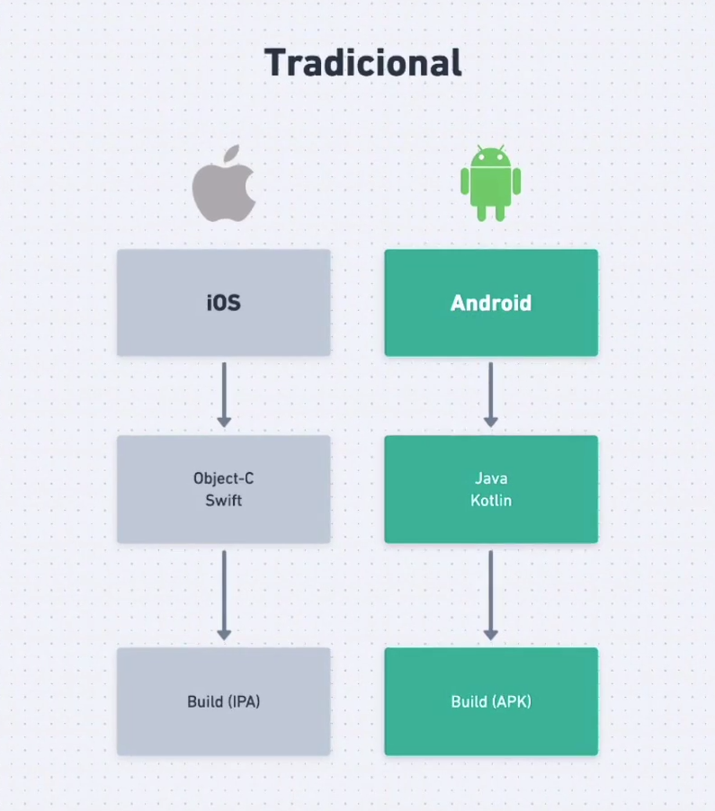
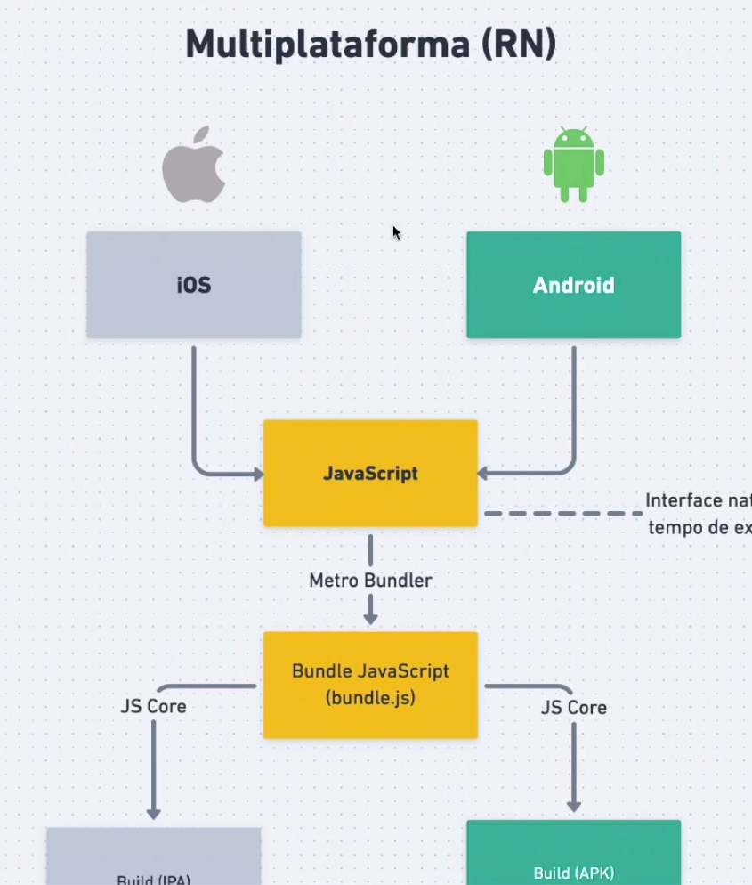
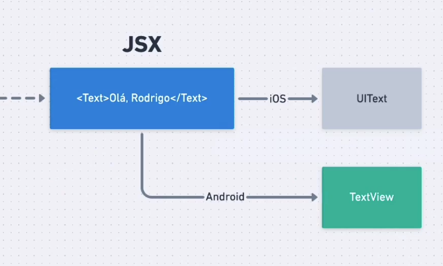
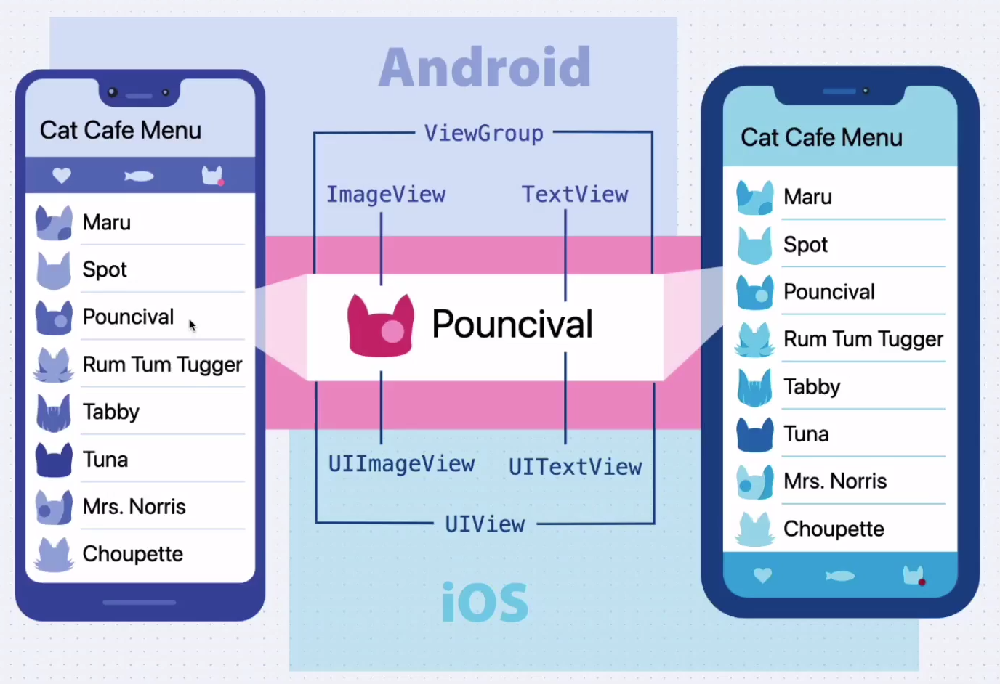

# React Native

## Fundamentos

### O que é React Native?

- Framework de criação de aplicações nativas mobile
- Projeto Open Source mantido pelo Facebook, desde 2015
- Multiplataforma
- Podemos manipular cada plataforma de forma diferente

### Características React Native

- Fast Refresh que dá feedback quase que instantâneo das alterações
- Uma base de código para as plataformas iOS e Android
- Javascript, uma linguagem muito popular.
- Comunidade ativida com inúmeras bibliotecas e UI frameworks

### Abordagem Tradicional

Essa abordagem é um modelo utilizado para o desenvolvimento de apps que exige conhecimento tanto em `Swift` quanto `Java/Kotlin`, havendo a necessidade de fazer o mesmo sistema com ambas as linguagens para haver portabilidade.



Já no modelo multiplataforma do React Native, a mesma base de código lhe permite compilar o projeto tanto em `Android` quando em `iOS`.

O processo de compilação do código segue o seguinte fluxo:


Escrevemos o código em JavaScript e para compilar o projeto ele passa pelo `Metro Bundler` e ele gera um pacote.js e apartir daí o `JS Core` compila com a arquitetura necessária.

### Sintaxe JSX

A elaboração de componentes em javascript utiliza a sintaxe JSX similar ao HTML que é utilizada pra criar componentes visuais.

```javascript
<Text>Olá, Lucas</Text>
```


### Modelo Visual

A interpretação é feita baseado nos componentes nativos de cada Sistema Operacional assim, simplificando o desenvolvimento dos aplicativos.



## Primeiro projeto

```bash
npx create-expo-app@latest projeto1-myskills -t
cd projeto1-myskills
npm run android
```

> [!IMPORTANT]
> Utilizando o `npx`, o projeto já instala o projeto com a ultima versão da cli e ao sair update, o projeto receberá as atualizações.

### Organização

```js
import React from "react"; // Permite utilizar a sintaxe JSX para desenvolver interface
import { View, Text } from "react-native"; // Trazer de dentro do react do contexto mobile

// View = div
// Text = Texto na tela

export default function App() {
    return(
        <View style={{ // Estilo inline
            flex: 1, // Ocupa a tela toda
            justifyContent: 'center', // Centraliza ao centro da tela na vertical
            alignItems: 'center'  // Centraliza ao centro da tela na horizontal
            }}>
            <Text>React Native</Text>
        </View>
    )
}
```

Não definir exportação default para o VSCode ter facilidade ao importar a página.

```js
// Home.js 
export function Home() {
    return (
        <View>
            <Text>Home</Text>
        </View>
    )
}

// App.js
import React from 'react';
import { Home } from './src/pages/Home';

export default App() {
    return (
        <Home />
    )
}
```

### Refatorando o estilo

```js
// Home.js 
import React from 'react';
import { View, Text, StyleSheet } from 'react-native'; 

export function Home() {
    return (
        <View style={styles.container}>
            <Text>Home</Text>
        </View>
    )
}

const styles = StyleSheet.create({
    container: {
        flex: 1, // Ocupa a tela toda
        justifyContent: 'center', // Centraliza ao centro da tela na vertical
        alignItems: 'center'  // Centraliza ao centro da tela na horizontal    
    }  
})
```

### Criando um input

```js
import React from 'react';
import {StyleSheet, TextInput } from 'react-native';

export function Home() {
    return (
        <>
            <TextInput
                style={styles.input}
                placeholder="New skill"
                placeholderTextColor="#555"
            />
        </>
    )
} 
const styles = StyleSheet.create({
    input: {
        backgroundColor: '#1F1E25',
        color: '#FFF',
        height: 40,
        marginTop: 20,
        padding: Platform.OS === 'ios' ? 15 : 10,
        borderRadius: 7
    },
})
```
### Criando um button

```js
import React from 'react';
import { StyleSheet, TouchableOpacity } from 'react-native';

export function Home() {
    return (
        <TouchableOpacity 
            style={styles.button}
            activeOpacity={0.7}>
                <Text style={styles.buttonText}>Add</Text>
        </TouchableOpacity>
    )

}

const styles = StyleSheet.create({
    button: {
        backgroundColor: '#A370F7',
        padding: 15,
        borderRadius: 7,
        alignItems: 'center',
        marginTop: 20
    }
})
```

### Vetor de estilos

```js

export function Home() {
    return (
        <View style={[styles.container, { marginTop: 20 }]}>
            <Text>Home</Text>
        </View>
    )
}

const styles = StyleSheet.create({
    container: {
        flex: 1, // Ocupa a tela toda
        justifyContent: 'center', // Centraliza ao centro da tela na vertical
        alignItems: 'center'  // Centraliza ao centro da tela na horizontal    
    }  
})
```

### Imutabilidade com useState

```js
import React, { useState } from 'react'; // Presente no react web

export function Home() {
    
    const [newSkill, setNewSkill] = useState(''); // Monitorar o input
    const [mySkills, setMySkills] = useState([]); // Lista de Skills

    function handleAddNewSkill() {
        setMySkills(oldSkill => (...oldSkill, newSkill)) //adiciona o valor do input dentro do array
    }

    return (

        <>
            <TextInput
            onChangeText={setNewSkill} // define o valor dentro do newSkill
            placeholder="Insira aqui" />

            <TouchableOpacity onPress={handleNewAddMySkill} // chama a função.
            > 
                <Text>Add</Text>
            </TouchableOpacity>
        </>

    )
}

```
